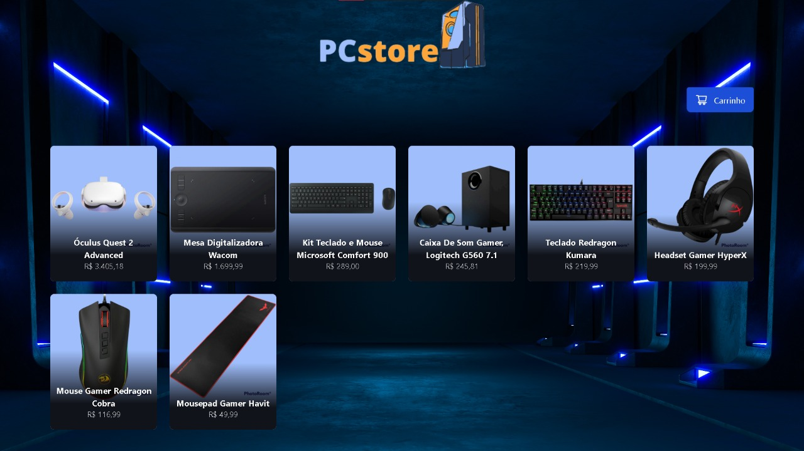

# PCstore

<h2>Portal que simula um site de compras de periféricos</h2>

<div>

</div>

<br>

> Status do projeto: Em desenvolvimento <br>
> Author: Dorival Junior

Para rodar o server e a web do projeto na sua máquina, execute no terminal:
```
npm run dev
```


  <h3 align="center">Linguagens e Ferramentas:</h3>
<div style="display: inline_block">
      <p align="center">
  <a href="https://www.typescriptlang.org/" target="_blank">
   <a href="https://pt-br.reactjs.org/" target="_blank">
   <a href="https://tailwindcss.com/" target="_blank">
  </div>

